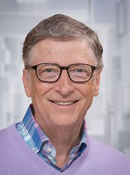
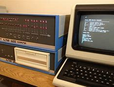

# Historia de Bill Gates
#### William Henry Gates III (Seattle, Washington; 28 de octubre de 1955), más conocido como Bill Gates, es un magnate empresarial, desarrollador de software, inversor, autor y filántropo estadounidense. Es cofundador de Microsoft.

#### El nombre de la compañía ( Micro-Soft ), proviene de una mezcla de " microcomputadora " y " software ". El primer producto de la compañía fue el software BASIC que se ejecutó en la computadora Altair.

#### La computadora Altair 8800 funcionaba utilizando el lenguaje de programación básico y un procesador de 8 bits con una velocidad de reloj de 2 MHz. Los usuarios podían ingresar y recuperar información a través de una serie de interruptores y luces LED, ya que la computadora no tenía un teclado ni una pantalla. Para almacenamiento, la Altair utilizaba cintas magnéticas o unidades de disquete externas.

  