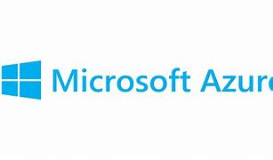

## Microsoft Azure
#### Es una plataforma de servicios en la nube ofrecida por Microsoft. Se trata de una de las principales plataformas de computación en la nube a nivel global y proporciona una amplia gama de servicios y recursos en la nube que permiten a las empresas, desarrolladores y organizaciones implementar, administrar y escalar aplicaciones y servicios de manera eficiente y rentable. Algunos aspectos clave de Microsoft Azure incluyen:

### Infraestructura como Servicio (IaaS):
#### Azure ofrece recursos virtuales como máquinas virtuales, redes virtuales y almacenamiento en la nube que permiten a las organizaciones crear y gestionar entornos informáticos escalables sin invertir en hardware físico.

### Plataforma como Servicio (PaaS): 
#### Azure proporciona una plataforma de desarrollo y alojamiento para aplicaciones web, móviles y de otro tipo. Esto facilita la creación, implementación y administración de aplicaciones sin preocuparse por la infraestructura subyacente.

### Contenedores y Orquestación: 
#### Azure ofrece servicios para la gestión de contenedores como Docker y Kubernetes, lo que facilita la creación y el despliegue de aplicaciones en contenedores para lograr una mayor flexibilidad y portabilidad.
