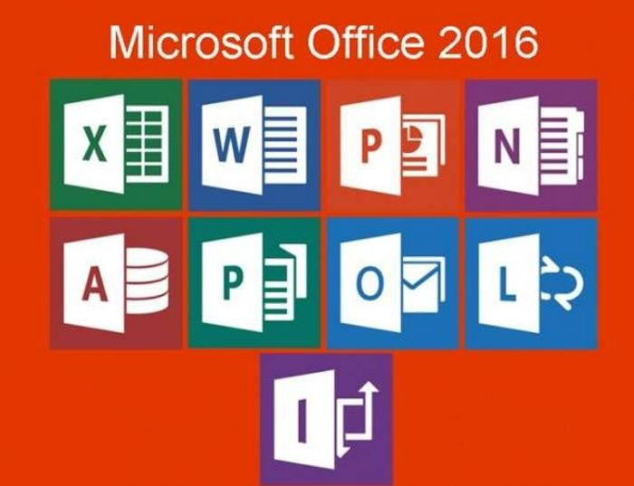

## Que es el Office 
#### "Office" se refiere a Microsoft Office, una suite de aplicaciones de software desarrollada por Microsoft. Microsoft Office es ampliamente utilizada en entornos empresariales y educativos para tareas de productividad, procesamiento de texto, creación de hojas de cálculo, presentaciones, administración de correos electrónicos, diseño gráfico y más. Algunas de las aplicaciones más conocidas que forman parte de Microsoft Office incluyen:

#### Microsoft Word: Un procesador de texto utilizado para crear y editar documentos de texto, como informes, cartas y currículos.

#### Microsoft Excel: Una hoja de cálculo que permite realizar cálculos, crear gráficos y tablas, y gestionar datos numéricos.

#### Microsoft PowerPoint: Una herramienta de presentación que facilita la creación de diapositivas, presentaciones y presentaciones visuales.

#### Microsoft Outlook: Una aplicación de correo electrónico y gestión de calendario utilizada para administrar correos electrónicos, programar citas y tareas, y gestionar contactos.

#### Microsoft Access: Una base de datos que permite a los usuarios crear y administrar bases de datos para almacenar y recuperar información.

#### Microsoft OneNote: Una aplicación de toma de notas digital que permite organizar y compartir notas, dibujos y grabaciones de voz.

#### Microsoft Publisher: Una aplicación de diseño gráfico que se utiliza para crear materiales de marketing, folletos, boletines informativos y otros documentos similares.

