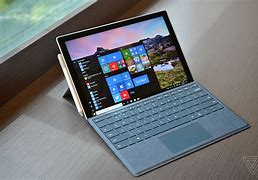

# Que es Surface
#### El término "Surface" se refiere a una línea de dispositivos electrónicos fabricados por Microsoft. Estos dispositivos están diseñados para ser versátiles y ofrecer una experiencia de computación moderna. A lo largo de los años, Microsoft ha lanzado varios tipos de dispositivos Surface, que incluyen:

## Surface Pro:
#### Surface Pro es una línea de dispositivos 2 en 1 que combinan las características de una tableta y una laptop. Estos dispositivos ejecutan el sistema operativo Windows 10 (o versiones posteriores) y son conocidos por su diseño delgado y liviano, así como por su soporte para el uso de un lápiz digital (Surface Pen) y un teclado desmontable (Surface Type Cover).

## Surface Laptop:
#### Surface Laptop es una serie de computadoras portátiles tradicionales con un diseño elegante y materiales premium. Ofrecen un rendimiento sólido y una experiencia de Windows optimizada. Los Surface Laptop son ideales para usuarios que prefieren una computadora portátil estándar.

## Surface Book:
#### Surface Book es una computadora portátil 2 en 1 con un teclado desmontable y una pantalla táctil que se puede utilizar como tableta. Está diseñada para usuarios que necesitan un alto rendimiento y versatilidad, entre otros.
