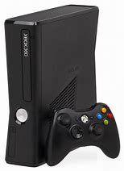
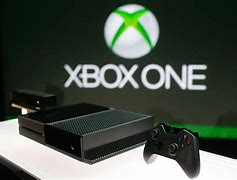

## Inicios de Xbox

#### Una consola Xbox es una línea de videoconsolas desarrollada y fabricada por Microsoft. Estas consolas están diseñadas específicamente para jugar videojuegos y ofrecen una amplia variedad de títulos de videojuegos, incluyendo juegos exclusivos de Xbox, así como juegos de terceros. Las consolas Xbox son muy populares en la industria del gaming y han competido con otras plataformas de juegos, como PlayStation de Sony y Nintendo.

#### A lo largo de los años, Microsoft ha lanzado varias generaciones de consolas Xbox, incluyendo la Xbox, Xbox 360, Xbox One y Xbox Series X/S. Cada una de estas generaciones ha mejorado en términos de potencia de hardware, gráficos, rendimiento en línea y capacidades multimedia. Además de jugar juegos, las consolas Xbox también ofrecen servicios de streaming de video, aplicaciones multimedia y acceso a servicios de suscripción como Xbox Game Pass, que permite a los jugadores acceder a una amplia biblioteca de juegos por una tarifa mensual.
          

#### En resumen, una consola Xbox es un dispositivo de entretenimiento en el hogar diseñado principalmente para jugar videojuegos, pero que también ofrece una variedad de otras funciones multimedia y servicios relacionados con el gaming.