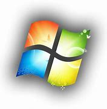
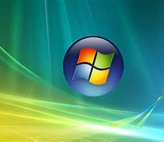

## Windows 7
#### Windows 7 es un sistema operativo desarrollado por Microsoft que se lanzó el 22 de octubre de 2009. Fue la sucesora de Windows Vista y representó una mejora significativa en términos de rendimiento, estabilidad y usabilidad. 
### Interfaz de Usuario Rediseñada: 
#### Windows 7 introdujo una interfaz de usuario más refinada en comparación con Windows Vista. Incluía la barra de tareas mejorada con iconos grandes y la función "Aero Peek" para previsualizar ventanas minimizadas. La función "Aero Snap" permitía organizar ventanas en la pantalla de manera eficiente.

### Mayor Estabilidad y Rendimiento: 
#### Windows 7 se ganó una reputación por ser más estable y eficiente en términos de recursos que su predecesor, Windows Vista. Esto hizo que la experiencia de usuario fuera más fluida y rápida.

 

### Librerías y Búsquedas Mejoradas: 
#### Introdujo las "Librerías" que agrupaban carpetas de diferentes ubicaciones en una sola vista. Además, mejoró la función de búsqueda, lo que facilitó la búsqueda y organización de archivos.

### Nueva Barra de Tareas:
#### La barra de tareas de Windows 7 permitía "anclar" aplicaciones favoritas para un acceso más rápido y tenía una vista previa en miniatura de las aplicaciones en ejecución cuando se pasaba el cursor sobre los iconos.