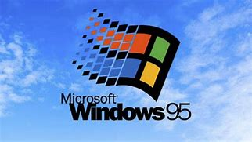

## Versiones de Windows
### Windows 95
#### Microsoft Windows 95 se lanzó el 24 de agosto de 1995 y el lanzamiento de Windows 95 tuvo un impacto significativo en la industria de la tecnología y en la forma en que las personas interactúan con las computadoras personales. Aquí hay algunas de las formas en que Windows 95 influyó en el mundo de la informática y más allá:

#### Interfaz Gráfica de Usuario (GUI) Amigable: Windows 95 introdujo una interfaz gráfica de usuario más intuitiva y amigable en comparación con las versiones anteriores de Windows. 
#### Soporte para Plug and Play: Windows 95 fue el primer sistema operativo de Microsoft en admitir completamente la tecnología Plug and Play, lo que facilitó la instalación de hardware y periféricos en las computadoras.
#### Compatibilidad de Aplicaciones: Windows 95 permitía ejecutar una amplia gama de aplicaciones diseñadas para versiones anteriores de Windows, lo que facilitó la transición de los usuarios a la nueva plataforma.
#### Mejoras en el Rendimiento: Aunque requería más recursos de hardware que versiones anteriores, Windows 95 ofrecía un mejor rendimiento y una mayor velocidad de ejecución de aplicaciones.